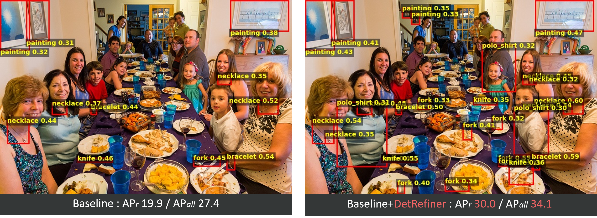

# DetRefiner: Model-Agnostic Detection Refinement with Feature Fusion Transformer [[Project Page]](https://sokazaki.github.io/detrefiner.github.io/)
by [Soichiro Okazaki](https://scholar.google.com/citations?user=GIGC74IAAAAJ), Tatsuya Sasaki, and [Hiroki Ohashi](https://scholar.google.com/citations?user=GKC6bbYAAAAJ).



This repository contains code for training and evaluating **DetRefiner**, a detection-score refinement model based on image and text features extracted from [MobileCLIP](https://github.com/apple/ml-mobileclip) and [DINOv3](https://github.com/facebookresearch/dinov3).

The code supports experiments on COCO, LVIS, and ODinW13 datasets.

## Environment

This code was tested with the following environment:

- Python: 3.9.18
- CUDA: 12.8
- PyTorch: 2.4.1
- torchvision: 0.19.0
- transformers: 4.56.2
- A CUDA-enabled GPU and Linux are recommended

## Installation

Install the main dependencies:

```bash
pip install torch==2.4.1 torchvision==0.19.0
pip install transformers==4.56.2
pip install numpy pillow pyyaml tqdm
pip install pycocotools
pip install lvis
```

This repository also depends on [MobileCLIP](https://github.com/apple/ml-mobileclip). Please install MobileCLIP following the official instructions from the MobileCLIP repository, and make sure that the following import works:

```python
import mobileclip
```

## External Datasets and Models

This repository does not include pretrained model weights, datasets, detector predictions, trained DetRefiner weights, or generated feature files.

Please prepare them separately by following the instructions below.

### Pretrained Models

The default scripts expect the following pretrained model files/directories:

```text
models/
  facebook/
    dinov3-vitb16-pretrain-lvd1689m/
  mobileclip_blt.pt
```

Please download or prepare the following models:

- [MobileCLIP-B-LT](https://huggingface.co/apple/MobileCLIP-B-LT)
- [DINOv3 ViT-B/16](https://huggingface.co/facebook/dinov3-vitb16-pretrain-lvd1689m)

### Datasets

The default scripts assume the following dataset files/directories before feature extraction:

```text
data/
  annotations/
    instances_train2017.json
    instances_val2017.json
    image_info_test2017.json
    lvis_v1_train.json
    lvis_v1_val.json
    lvis_v1_image_info_test_dev.json
  annotations_created/
  odinw/
    AerialMaritimeDrone/
    ...
  odinw13_config/
  train2017/
  val2017/
```

Please prepare these files/directories as follows:

- `data/train2017/`, `data/val2017/`, and COCO annotation files under `data/annotations/` can be downloaded from the [COCO dataset website](https://cocodataset.org/#download).
- LVIS annotation files under `data/annotations/` can be downloaded from the [LVIS dataset website](https://www.lvisdataset.org/dataset).
- `data/odinw/` can be prepared by following the [ODinW instructions in the GLIP repository](https://github.com/Colin97/GLIP/blob/main/odinw/README.md).
- `data/annotations_created/` can be downloaded from [`data/annotations_created/`](https://huggingface.co/sokazaki/detrefiner/tree/main/data/annotations_created).
- `data/odinw13_config/` can be downloaded from [`data/odinw13_config/`](https://huggingface.co/sokazaki/detrefiner/tree/main/data/odinw13_config).

### Detector Predictions and Trained DetRefiner Weights

The evaluation script expects detector prediction JSON files and trained DetRefiner weights under:

```text
eval_results/
trained_models/
```

Please download them from the following Hugging Face directories and place them in the corresponding local directories:
- [`eval_results/`](https://huggingface.co/sokazaki/detrefiner/tree/main/eval_results)
- [`trained_models/`](https://huggingface.co/sokazaki/detrefiner/tree/main/trained_models)

To reproduce [`eval_results/`](https://huggingface.co/sokazaki/detrefiner/tree/main/eval_results), run the following evaluation scripts.
```bash
python evaluate_glipmodel.py --dataset coco --model-size tiny   # for GLIP
python evaluate_hfmodels.py --dataset coco --model-name grounding-dino-tiny   # for Grounding-DINO/MM-Grounding-DINO/LLMDet
```
For GLIP, please set up the environment, configs, and checkpoints according to the official [`GLIP repository`](https://github.com/microsoft/GLIP).\
For the other models, please download the corresponding checkpoints from the Hugging Face Model Hub and place them under `./data/huggingface/`.

### Generate Feature Files

Before training or evaluation, generate ground-truth label/bounding-box files, text features, and visual features.

Please run the scripts in the following order:

```bash
python extract_gt_labels_bboxes.py
python extract_text_features.py
python extract_visual_features.py
python extract_lvis_images.py
```

The scripts generate `.pkl` files under the `data/` directory, such as `data/gt_*`, `data/textfeatures_*`, and `data/visionfeatures_*`, as shown below.

```text
data/gt_train2017/
data/gt_train2017_lvis/
data/gt_val2017/
data/gt_odinw13/
data/textfeatures_coco.pkl
data/textfeatures_lvis.pkl
data/textfeatures_odinw13/
data/visionfeatures_train2017/
data/visionfeatures_train2017_lvis/
data/visionfeatures_val2017/
data/visionfeatures_odinw13/
```

Note that `extract_lvis_images.py` uses files generated by `extract_gt_labels_bboxes.py` and `extract_visual_features.py`, so it should be run after those scripts.

## Training

Run:

```bash
python train_detrefiner.py
```

By default, the training script assumes:

```text
dataset = "coco"
```

To train on LVIS, please edit the corresponding variables in the script (line 867).
Full trained models for each dataset are already available in the [`trained_models/`](https://huggingface.co/sokazaki/detrefiner/tree/main/trained_models).

## Evaluation

Run:

```bash
python test_detrefiner.py
```

By default, the evaluation script assumes:

```text
dataset = "coco"
```

To evaluate on LVIS or ODinW13, please edit the corresponding variables in the script (line 788).
Result text files for each dataset are already available in the [`misc/`](https://huggingface.co/sokazaki/detrefiner/tree/main/misc).

## Recommended File Structure

A typical project structure before running training or evaluation is:

```text
.
├── data/
│   ├── annotations/
│   ├── annotations_created/
│   ├── gt_odinw13/
│   ├── gt_train2017/
│   ├── gt_train2017_lvis/
│   ├── gt_val2017/
│   ├── odinw/
│   ├── odinw13_config/
│   ├── textfeatures_odinw13/
│   ├── train2017/
│   ├── val2017/
│   ├── visionfeatures_odinw13/
│   ├── visionfeatures_train2017/
│   ├── visionfeatures_train2017_lvis/
│   ├── visionfeatures_val2017/
│   ├── textfeatures_coco.pkl
│   └── textfeatures_lvis.pkl
├── eval_results/
├── models/
│   ├── mobileclip_blt.pt
│   └── facebook/
│       └── dinov3-vitb16-pretrain-lvd1689m/
├── trained_models/
├── extract_gt_labels_bboxes.py
├── extract_lvis_images.py
├── extract_text_features.py
├── extract_visual_features.py
├── test_detrefiner.py
└── train_detrefiner.py
```

## TODO
The demo script will be released soon.\
DetRefiner models trained on additional datasets (e.g., SA-Co Dataset) will be released later.

## Citation
```
@InProceedings{Okazaki_2026_CVPR,
    author    = {Okazaki, Soichiro and Sasaki, Tatsuya and Ohashi, Hiroki},
    title     = {DetRefiner: Model-Agnostic Detection Refinement with Feature Fusion Transformer},
    booktitle = {Proceedings of the IEEE/CVF Conference on Computer Vision and Pattern Recognition (CVPR) Findings},
    month     = {June},
    year      = {2026},
    pages     = {6890-6900}
}
```
